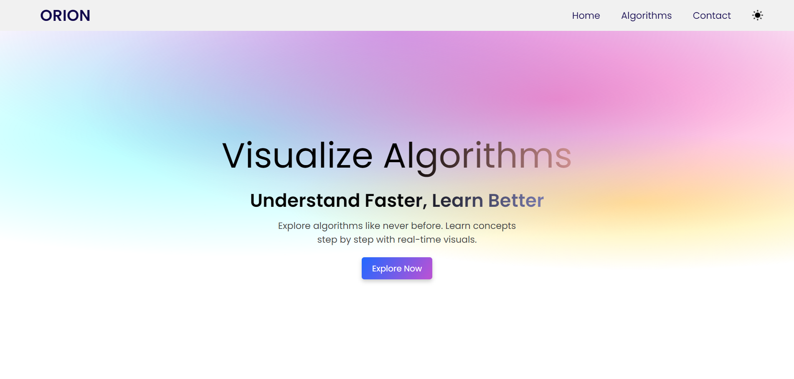
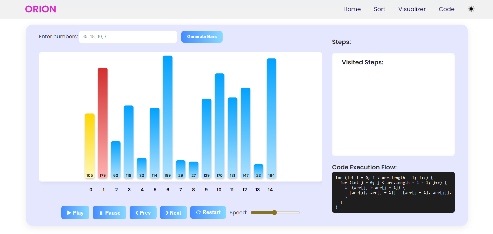

# 🔍 Orion — DSA Visualizer

**Orion** is a modern, interactive **Data Structures & Algorithms visualizer** designed to help students and developers understand complex concepts through clean animations and intuitive controls.

This project focuses on **learning by seeing**, making DSA less abstract and more practical.

---

## 🎯 Objective

The primary goals of **Orion** are:

* 📌 Visualize how Data Structures and Algorithms work internally
* 📌 Help beginners build strong DSA intuition
* 📌 Provide a clean, modern, and extensible learning platform
* 📌 Offer an open-source project for learning and contribution

---

## 🌟 Key Features

* ✨ Clean, modern, and minimal UI
* 📊 Interactive visualizations for major DSA topics
* 🧠 Step-by-step algorithm execution
* 🌙 Dark mode supported
* ⚡ Lightweight and fast (no heavy frameworks)
* 📁 Modular and easy-to-extend codebase

---

## 📚 Supported Visualizations

### Data Structures

* Arrays (Insertion, Deletion, Traversal)
* Singly & Doubly Linked Lists
(updating more soon...)

### Algorithms

* Sorting Algorithms

  * Bubble Sort
  * Selection Sort
  * Insertion Sort
  * Merge Sort
  * Quick Sort

---

## 🖥️ Tech Stack

* **Frontend:** HTML, CSS, JavaScript
* **Styling:** Custom CSS (Flat & Minimal UI)
* **Animations:** CSS transitions + DOM manipulation

---

## 🚀 Live Demo

👉 [Live Link](https://orion14.netlify.app/)

---

## 📸 Screenshots




---

## 🛠️ Installation & Usage

Follow these steps to run **Orion** locally:

### 1️⃣ Clone the repository

```bash
git clone https://github.com/gaurav-gunjal14/Projects/tree/main/DSA-Visulizer.git
```

### 2️⃣ Navigate to project folder

```bash
cd DSA-Visualizer
```

### 3️⃣ Open in browser

```bash
Open index.html directly in your browser
```

*No additional setup required.*

---

## 📂 Project Structure

```bash
DSA-Visualizer/
│── public/
│   ├── icons/
│   │   ├── ...
│   ├── manifest.json
│── src/
│   ├── arry/
│   │   ├── array.html
│   ├── sort/
│   │   ├── sort.html
│   │   ├── sortLogic.js
│   ├── home.js
│   ├── style.css
│── README.md
│── index.html
│── service-worker.js
```

---

## 🧩 Future Enhancements

* ⏱️ Time & Space Complexity display
* 🎛️ Speed control for animations
* 🧪 Practice mode with user input
* 📱 Improved mobile experience
* ⚛️ React-based version (planned)

---

## 👨‍💻 About the Developer

Hi, I’m **Gaurav** 👋
An IT engineering student passionate about **frontend development, React, and building learning-focused projects**.

This project reflects my interest in combining **DSA + UI + real-world usability**.

🔗 Connect with me:
* Portfolio: [https://gauravgunjal.netlify.app/](https://gauravgunjal.netlify.app/)
* GitHub: [https://github.com/gauravGunjal14](https://github.com/gauravGunjal14)
* LinkedIn: [https://www.linkedin.com/in/gaurav-gunjal14/](https://www.linkedin.com/in/gaurav-gunjal14/)
* X (Twitter): [https://x.com/gaurav_gunjal14](https://x.com/gaurav_gunjal14)

---

## 📜 License

This project is open-source and licensed under the **MIT License**.
Feel free to use, modify, and contribute ✨
